# Normalized View Design

**Role:** Proposed target architecture for the normalized view layer that will support the end product.

This document is intentionally discussion-first. It defines which views should exist, why they should exist, what grain each view should use, and which refined tables should feed them. It does not implement SQL.

Claims data remains out of scope for this repository. The historical requirement addressed here is the MED-File side of the problem: build views that expose the correct reference state for a given Medi-Span file month so an external audit or claims system can join claims to the appropriate monthly reference set.

Status:

MVP views (all implemented):

- `medfile.v_product_package_current` is implemented
- `medfile.v_product_package_price_current` is implemented
- `medfile.v_product_package_modifier_current` is implemented
- `medfile.v_product_package_monthly` is implemented (materialized)
- `medfile.v_product_package_price_monthly` is implemented (materialized, all price codes)
- `medfile.v_product_package_price_awp_monthly` is implemented (materialized, AWP only, price_code = 'A')
- `medfile.v_product_package_price_wac_monthly` is implemented (materialized, WAC only, price_code = 'W')
- `medfile.v_product_package_price_dp_monthly` is implemented (materialized, DP only, price_code = 'D')
- `medfile.v_gpi_ndc_equivalent_monthly` is implemented (materialized)

Later-phase views (all implemented):

- `medfile.v_product_package_price_history` is implemented
- `medfile.v_gpi_current` is implemented
- `medfile.v_gppc_current` is implemented
- `medfile.v_gpi_ndc_equivalent_current` is implemented
- `medfile.v_drug_name_current` is implemented
- `medfile.v_routed_drug_current` is implemented
- `medfile.v_drug_dose_form_current` is implemented
- `medfile.v_routed_drug_form_current` is implemented
- `medfile.v_dispensable_drug_current` is implemented
- `medfile.v_dispensable_drug_rollup_current` is implemented
- `medfile.v_concept_ingredient_set_current` is implemented
- `medfile.v_ingredient_set_member_current` is implemented
- `medfile.v_ingredient_current` is implemented
- `medfile.v_concept_ingredient_current` is implemented
- `medfile.v_code_lookup_current` is implemented
- `medfile.v_concept_description_current` is implemented
- `medfile.v_concept_reference_name_current` is implemented
- `medfile.v_alternate_id_current` is implemented

Legacy views have been removed from the codebase. The orphan cleanup mechanism drops them from the database automatically on the next view run.

All monthly views are materialized for query performance and refreshed concurrently so reads are never blocked. Each has a unique index for concurrent refresh plus query indexes for interactive UI use (NDC, GPI, month, drug name).

These views use `reference_month` derived from `medfile.refine_runs.file_date`.

Current implementation rules:

- if multiple completed refine runs exist in the same file month, the latest completed run is used as that month's published reference set
- after incremental refine, use `uv run python -m view --refresh-only` to refresh materialized views without recreating regular views
- use `uv run python -m view --reset` to drop and recreate materialized views after definition changes

---

## Why A New View Design Is Needed

The current `view` layer proves the pipeline works, but it is not yet a complete normalized consumer-facing surface.

Current state:

- [view/entity_views.py](../view/entity_views.py) generates `v_ndc`, `v_ndc_price`, and `v_drg` directly from refine rules.
- Those views select `r.*`, which makes them broad passthroughs over refinement tables rather than stable downstream contracts.
- [view/pcip_views.py](../view/pcip_views.py) adds curated views for `v_ndc_pcip_reference`, `v_gpi_equivalents`, and `v_drg_maintenance`.
- Those curated views are useful, but they only cover a narrow slice of the eventual product surface.

The end product needs a view layer with explicit semantics:

- one view should represent one business grain
- current-state views should be clearly separated from monthly historical views
- helper lookup views should be separate from business-facing reference views
- consumers should not have to reconstruct core joins across NDC, GPPC, GPI, DDID, pricing, clinical hierarchy, and ingredients themselves

---

## Current Gaps

### 1. Entity views are not normalized contracts

The current entity views are mostly generated from refine rules and expose nearly all refinement columns. That is efficient for internal inspection, but not ideal for a durable end-product surface.

Examples:

- `v_ndc` is the richest of the current entity views, but it is still built as `r.*` plus MF2VAL descriptions and one derived `ndc_formatted`.
- `v_ndc_price` exposes append-only price rows and status metadata instead of a curated current-price surface.
- `v_drg` is a direct pass-through over `refinement_drg` with no concept enrichment.

Reasoning:

- downstream consumers need stable semantic columns, not table-shaped passthroughs
- exposing all refinement columns makes it harder to evolve the underlying tables safely
- broad entity views encourage business logic to spread into downstream queries

### 2. Current and monthly-historical concerns are mixed

The refinement layer explicitly models history through `scd2` and `append_only`, but the current entity views do not consistently present either a clear current-state contract or a month-specific audit contract.

Reasoning:

- current reference consumers should not need to interpret `is_current`, `is_active`, or effective-date semantics in every query
- monthly audit consumers need separate views with explicit Medi-Span file-month semantics

### 3. The view layer is NDC-heavy but not domain-complete

The current curated views focus on NDC reference and generic-equivalence logic. That matches the initial PCIP direction, but the refined schema already contains richer domains:

- packaged drug identity and pricing
- therapeutic hierarchy
- clinical drug hierarchy
- ingredient composition
- terminology and alternate IDs

Reasoning:

- the end product will need more than NDC lookup and AWP lookup
- a normalized design should reflect the full structure of the refined MED-File model
- the end product must support both current reference use and month-based audit reference use

### 4. There is no single universal product bridge

The refined schema has strong join anchors, but not one universal bridge across every domain.

Strong anchors that do exist:

- NDC -> DDID via `refinement_ndc.drug_descriptor_id = refinement_name.drug_descriptor_id`
- NDC -> GPPC via `refinement_ndc.gppc_code = refinement_gppc.gppc_code`
- GPPC -> GPI via `refinement_gppc.generic_product_identifier`
- clinical hierarchy through `drgnm`, `rtdrg`, `rtdf`, `dfdrg`, and `drg`
- ingredients through `set`, `ings`, `str`, and `idrg`

Important limitation:

- there is no obvious direct NDC-to-DRG bridge in the current rules

Reasoning:

- the view design should not pretend one denormalized mega-view can model everything cleanly
- the better target is a layered view family with well-defined join surfaces

---

## Design Principles

These rules should apply to every new normalized view.

1. One view equals one grain.
2. Current-state views should filter `scd2` sources with `is_current = true`.
3. Current-state views should filter append-only sources with `is_active = true` unless the view is explicitly month-historical.
4. Consumer-facing views should avoid `SELECT *`.
5. Stable semantic names are preferred over raw field names when they improve clarity.
6. Helper and lookup views should be separate from business-facing reference views.
7. Monthly historical views should be explicitly named as monthly or historical, not mixed into current views.
8. Views should follow existing process boundaries: built in `view/`, sourced from `medfile`, and never from `rxraw`.
9. Historical audit semantics should follow the Medi-Span file month, not claim-date point-in-time logic inside this repository.

---

## Refined Domains Available

The current refined schema already supports a layered normalized model.

### Packaged drug and pricing

Primary sources:

- [refine/rules/ndc.yaml](../refine/rules/ndc.yaml)
- [refine/rules/ndc_price.yaml](../refine/rules/ndc_price.yaml)
- [refine/rules/gppc.yaml](../refine/rules/gppc.yaml)
- [refine/rules/name.yaml](../refine/rules/name.yaml)
- [refine/rules/lab.yaml](../refine/rules/lab.yaml)
- [refine/rules/ndcm.yaml](../refine/rules/ndcm.yaml)
- [refine/rules/mod.yaml](../refine/rules/mod.yaml)

This is the strongest current downstream domain because external audit and pharmacy workflows usually join at the NDC level.

### Therapeutic classification

Primary sources:

- [refine/rules/gppc.yaml](../refine/rules/gppc.yaml)
- [refine/rules/tcgpi.yaml](../refine/rules/tcgpi.yaml)
- [refine/rules/ndc.yaml](../refine/rules/ndc.yaml)

This domain supports GPI lookup, substitution logic, and class navigation.

### Clinical drug hierarchy

Primary sources:

- [refine/rules/drgnm.yaml](../refine/rules/drgnm.yaml)
- [refine/rules/rtdrg.yaml](../refine/rules/rtdrg.yaml)
- [refine/rules/rtdf.yaml](../refine/rules/rtdf.yaml)
- [refine/rules/dfdrg.yaml](../refine/rules/dfdrg.yaml)
- [refine/rules/drg.yaml](../refine/rules/drg.yaml)
- [refine/rules/rte.yaml](../refine/rules/rte.yaml)
- [refine/rules/frm.yaml](../refine/rules/frm.yaml)
- [refine/rules/stuom.yaml](../refine/rules/stuom.yaml)

This domain models clinical concept levels and should be exposed as concept-level views, not flattened blindly into an NDC view.

### Ingredient composition

Primary sources:

- [refine/rules/set.yaml](../refine/rules/set.yaml)
- [refine/rules/ings.yaml](../refine/rules/ings.yaml)
- [refine/rules/str.yaml](../refine/rules/str.yaml)
- [refine/rules/idrg.yaml](../refine/rules/idrg.yaml)

This domain supports ingredient composition, active ingredient rollups, and ingredient-strength analysis.

### Terminology and alternate IDs

Primary sources:

- [refine/rules/mf2val.yaml](../refine/rules/mf2val.yaml)
- [refine/rules/desc.yaml](../refine/rules/desc.yaml)
- [refine/rules/sec.yaml](../refine/rules/sec.yaml)
- [refine/rules/rnm.yaml](../refine/rules/rnm.yaml)

This domain should provide reusable helper surfaces instead of forcing every business view to recreate terminology joins.

---

## Proposed View Families

The target architecture should be a set of normalized view families. Each family below describes the intended grain, purpose, source tables, and reasoning.

### Family 1: Packaged Drug Reference

This family is the MVP anchor for the end product.

It should support both:

- current reference views for present-day lookup
- monthly reference views keyed by Medi-Span file month for retrospective audit

#### `v_product_package_current`

Proposed grain:

- one current row per `ndc_upc_hri`

Primary sources:

- `medfile.refinement_ndc`
- `medfile.refinement_name`
- `medfile.refinement_gppc`
- `medfile.refinement_lab`
- MF2VAL translations through `medfile.mf2val`

Purpose:

- canonical current packaged-drug reference surface
- primary join target for NDC-based external audit enrichment
- stable carrier for product identity, packaging, labeler, and key clinical flags

Recommended contents:

- NDC identity and formatted NDC
- DDID and drug name
- GPPC and GPI
- labeler identity
- item status, RX/OTC, DEA, TEE, multi-source, maintenance-related flags
- package size, quantity, package units, package description code
- current specialty proxy inputs and derived specialty flag

Reasoning:

- the current `v_ndc` and `v_ndc_pcip_reference` together already hint at this shape
- this should become the main downstream product reference surface
- it should replace the consumer role of `v_ndc` and most of `v_ndc_pcip_reference`

#### `v_product_package_modifier_current`

Proposed grain:

- one current row per `(ndc_upc_hri, modifier_code)`

Primary sources:

- `medfile.refinement_ndcm`
- `medfile.refinement_mod`

Purpose:

- normalized modifier attachment surface for packaged drug records

Reasoning:

- modifiers are one-to-many from NDC and should not be flattened into the main packaged-drug row
- keeping them separate preserves grain discipline

#### `v_product_package_price_current`

Proposed grain:

- one current row per `(ndc_upc_hri, price_code)`

Primary sources:

- `medfile.refinement_ndc_price`

Purpose:

- current normalized price view for packaged drugs
- support AWP and other price-code lookups without exposing full append-only history as the default

Recommended contents:

- NDC
- price code and price code description
- current active unit, extended, and package prices
- effective date
- AWP indicator and description

Reasoning:

- `v_ndc_price` currently exposes append-only rows rather than a canonical current-price contract
- pricing should be normalized separately so the product reference view can either join it or expose a selected slice from it

Decision to settle later:

- whether `latest_awp_unit_price` stays embedded in the main package reference view
- whether all price codes remain in a separate view and only AWP is carried into the main NDC view

#### `v_product_package_monthly`

Proposed grain:

- one row per `(reference_month, ndc_upc_hri)`

Primary sources:

- `medfile.refine_runs`
- `medfile.refinement_ndc`
- `medfile.refinement_name`
- `medfile.refinement_gppc`
- `medfile.refinement_lab`

Purpose:

- canonical monthly packaged-drug reference surface
- one stable record per NDC per Medi-Span file month
- the preferred reference surface for retrospective audit use

Recommended contents:

- `reference_month`
- NDC identity and formatted NDC
- DDID and drug name
- GPPC and GPI
- labeler identity
- item status, RX/OTC, DEA, TEE, multi-source, maintenance-related flags
- package size, quantity, package units, package description code
- current-for-that-month specialty inputs and derived specialty flag

Reasoning:

- the audit rule discussed for this product is month-based, not claim-date-based
- Medi-Span is delivered monthly, so the cleanest historical reference contract is a monthly view keyed to the source file month
- this lets an external audit system map a claim's paid or processed month to the correct Medi-Span month without pushing claims logic into this repo

#### `v_product_package_price_monthly`

Proposed grain:

- one row per `(reference_month, ndc_upc_hri, price_code)`

Primary sources:

- `medfile.refine_runs`
- `medfile.refinement_ndc_price`

Purpose:

- canonical monthly price view for audit lookups across all price types
- one month-specific pricing surface per NDC and price code

Reasoning:

- audit pricing should follow the Medi-Span file month
- the current price view is useful for present-day lookup, but monthly audit workflows need a month-keyed benchmark view

#### `v_product_package_price_awp_monthly`

Proposed grain:

- one row per `(reference_month, ndc_upc_hri)`

Primary sources:

- `medfile.refine_runs`
- `medfile.refinement_ndc_price` (filtered to `price_code = 'A'`)

Purpose:

- monthly AWP (Average Wholesale Price) view for pharmacy audit
- the primary pricing benchmark for claims adjudication and reimbursement

Reasoning:

- AWP is by far the most commonly used pricing benchmark in pharmacy
- a dedicated AWP view provides a clean 1:1 grain per NDC per month without requiring consumers to filter by price code
- downstream audit systems can join directly on `(reference_month, ndc_upc_hri)` for AWP

#### `v_product_package_price_wac_monthly`

Proposed grain:

- one row per `(reference_month, ndc_upc_hri)`

Primary sources:

- `medfile.refine_runs`
- `medfile.refinement_ndc_price` (filtered to `price_code = 'W'`)

Purpose:

- monthly WAC (Wholesale Acquisition Cost) view
- the manufacturer-to-wholesaler price benchmark

Reasoning:

- WAC serves a different business purpose than AWP (acquisition cost vs reimbursement benchmark)
- separating WAC from AWP prevents consumers from accidentally mixing benchmarks

#### `v_product_package_price_dp_monthly`

Proposed grain:

- one row per `(reference_month, ndc_upc_hri)`

Primary sources:

- `medfile.refine_runs`
- `medfile.refinement_ndc_price` (filtered to `price_code = 'D'`)

Purpose:

- monthly DP (Direct Price) view
- the direct manufacturer-to-pharmacy price benchmark

Reasoning:

- DP is a distinct pricing channel and should not be mixed with AWP or WAC in default consumer queries
- a dedicated view simplifies direct-price analysis workflows

#### `v_product_package_price_history`

Proposed grain:

- one row per `(ndc_upc_hri, price_code, price_effective_date)`

Primary sources:

- `medfile.refinement_ndc_price`

Purpose:

- explicit price-history surface

Reasoning:

- price history is valuable, but it should not be mixed into current-state or month-keyed reference views

---

### Family 2: GPI and Equivalence

This family should separate therapeutic-class and substitution semantics from the NDC master reference.

#### `v_gpi_current`

Proposed grain:

- one current row per `gpi`

Primary sources:

- `medfile.refinement_gppc`
- `medfile.refinement_tcgpi`

Purpose:

- canonical current GPI classification surface
- reusable therapeutic hierarchy lookup

Recommended contents:

- GPI
- TC-GPI name
- TC level
- representative flags or helper classification fields if useful

Reasoning:

- current views expose GPI mostly as a join output rather than as a first-class domain

#### `v_gpi_ndc_equivalent_current`

Proposed grain:

- one current row per `(gpi, ndc_upc_hri)`

Primary sources:

- `medfile.refinement_ndc`
- `medfile.refinement_gppc`
- `medfile.refinement_tcgpi`

Purpose:

- normalized generic-equivalence candidate view
- direct successor to `v_gpi_equivalents`

Recommended contents:

- GPI
- NDC
- TEE
- multi-source
- partial/non-partial indicators
- optional reason flags showing why a row qualifies

Reasoning:

- substitution logic is a distinct business contract and should stay separate from the general NDC view
- this is a natural curated view for generic-availability workflows

#### `v_gpi_ndc_equivalent_monthly`

Proposed grain:

- one row per `(reference_month, gpi, ndc_upc_hri)`

Primary sources:

- `medfile.refine_runs`
- `medfile.refinement_ndc`
- `medfile.refinement_gppc`
- `medfile.refinement_tcgpi`

Purpose:

- month-keyed substitution and equivalence surface for retrospective audit

Reasoning:

- substitution eligibility can change over time
- a monthly view prevents current-state GPI equivalence logic from being incorrectly applied to older audit months

#### `v_gppc_current`

Proposed grain:

- one current row per `gppc_code`

Primary sources:

- `medfile.refinement_gppc`
- optionally `medfile.refinement_gpr` for current GPPC-level pricing in a companion price view

Purpose:

- normalized packaging-level reference between NDC and GPI domains

Reasoning:

- GPPC is a meaningful business object in the refined model
- exposing it cleanly gives the system a reusable middle layer between NDC and GPI

---

### Family 3: Clinical Concept Hierarchy

This family should expose MED-File clinical concepts at their own natural levels. It should not be forced into a single oversized denormalized view.

#### `v_drug_name_current`

Proposed grain:

- one current row per `(concept_type, country_code, concept_id)` for `drgnm`

Primary sources:

- `medfile.refinement_drgnm`
- `medfile.refinement_desc`

Purpose:

- normalized drug-name concept layer

#### `v_routed_drug_current`

Proposed grain:

- one current row per routed drug concept

Primary sources:

- `medfile.refinement_rtdrg`
- `medfile.refinement_drgnm`
- `medfile.refinement_rte`
- `medfile.refinement_desc`

Purpose:

- routed drug concept with drug-name and route enrichment

#### `v_drug_dose_form_current`

Proposed grain:

- one current row per drug-dose-form concept

Primary sources:

- `medfile.refinement_dfdrg`
- `medfile.refinement_drgnm`
- `medfile.refinement_frm`
- `medfile.refinement_desc`

Purpose:

- normalized drug-plus-dose-form layer

#### `v_routed_drug_form_current`

Proposed grain:

- one current row per routed-drug-form concept

Primary sources:

- `medfile.refinement_rtdf`
- `medfile.refinement_rtdrg`
- `medfile.refinement_frm`
- `medfile.refinement_desc`

Purpose:

- normalized routed-drug-plus-form layer

#### `v_dispensable_drug_current`

Proposed grain:

- one current row per dispensable drug concept

Primary sources:

- `medfile.refinement_drg`
- `medfile.refinement_rtdrg`
- `medfile.refinement_rtdf`
- `medfile.refinement_dfdrg`
- `medfile.refinement_frm`
- `medfile.refinement_stuom`
- `medfile.refinement_desc`

Purpose:

- canonical DDID-centric current clinical drug surface

Reasoning for the family:

- the refined schema already models the concept hierarchy explicitly
- downstream clinical use cases should consume concept-appropriate views instead of reconstructing hierarchy joins from raw refinement tables
- multiple concept-level views are better than one overloaded rollup because each level has a distinct grain and meaning

Optional later convenience view:

- `v_dispensable_drug_rollup_current`

This could offer a flattened consumable summary over the hierarchy, but it should be built only after the concept-level views exist.

---

### Family 4: Ingredient Composition

This family should model ingredient relationships as their own domain.

#### `v_concept_ingredient_set_current`

Proposed grain:

- one current row per `(concept_type, country_code, concept_id)`

Primary sources:

- `medfile.refinement_set`

Purpose:

- current mapping from concept to ingredient set

#### `v_ingredient_set_member_current`

Proposed grain:

- one current row per `(ingredient_set_id, ingredient_id)`

Primary sources:

- `medfile.refinement_ings`

Purpose:

- normalized ingredient-set membership surface

#### `v_ingredient_current`

Proposed grain:

- one current row per `ingredient_id`

Primary sources:

- `medfile.refinement_str`
- `medfile.refinement_idrg`

Purpose:

- canonical ingredient reference with ingredient drug naming and strength semantics

#### `v_concept_ingredient_current`

Proposed grain:

- one current row per `(concept_type, country_code, concept_id, ingredient_id)`

Primary sources:

- `medfile.refinement_set`
- `medfile.refinement_ings`
- `medfile.refinement_str`
- `medfile.refinement_idrg`

Purpose:

- end-product ingredient composition bridge

Reasoning:

- ingredient analysis is a core normalized subject area
- composition belongs in a separate view family because it is inherently one-to-many from concept or packaged drug surfaces

Important limitation:

- this family is naturally concept-centric from the current refined model
- if later business needs require NDC-to-ingredient directly, that bridge may need to be derived through a concept mapping rather than assumed to exist today

---

### Family 5: Terminology and Alternate IDs

This family should provide reusable helper surfaces.

#### `v_code_lookup_current`

Proposed grain:

- one current row per `(field_id, field_value, language_cd)`

Primary sources:

- `medfile.mf2val`

Purpose:

- reusable code-description translation layer

Reasoning:

- business-facing views should not each reinvent translation logic

#### `v_concept_description_current`

Proposed grain:

- one current row per `(concept_type, country_code, concept_id, type_code)`

Primary sources:

- `medfile.refinement_desc`

Purpose:

- reusable concept-description surface

#### `v_concept_reference_name_current`

Proposed grain:

- one current row per `(concept_type, country_code, concept_id)`

Primary sources:

- `medfile.refinement_rnm`

Purpose:

- reusable generic-name reference mapping

#### `v_alternate_id_current`

Proposed grain:

- one current row per `(external_drug_id, alternate_drug_id)`

Primary sources:

- `medfile.refinement_sec`

Purpose:

- reusable alternate-ID crosswalk

Reasoning for the family:

- these are essential lookup and crosswalk surfaces
- they should remain distinct from the main product and clinical views
- some may be internal helper views rather than public downstream contracts

---

## MVP Versus Later Phases

The normalized target architecture is broader than the first delivery. The view roadmap should therefore separate MVP views from later-phase completeness.

### MVP Views

These are the views most necessary for the current end product.

1. `v_product_package_current`
2. `v_product_package_monthly`
3. `v_product_package_price_monthly` (all price codes)
4. `v_product_package_price_awp_monthly` (AWP only)
5. `v_product_package_price_wac_monthly` (WAC only)
6. `v_product_package_price_dp_monthly` (DP only)
7. `v_gpi_ndc_equivalent_monthly`
8. `v_product_package_price_current`
9. `v_product_package_modifier_current`

MVP reasoning:

- the current product direction is NDC-centered
- the core business scenario is monthly pharmacy audit, so monthly reference views belong in the MVP rather than a later phase
- pricing, maintenance, specialty, and substitution logic already point to a packaged-drug reference layer
- these views can replace most downstream use of `v_ndc`, `v_ndc_price`, `v_ndc_pcip_reference`, and `v_gpi_equivalents`

Suggested MVP treatment of existing views:

- deprecate `v_ndc` as a consumer-facing contract
- deprecate `v_ndc_price` as a consumer-facing contract
- replace `v_ndc_pcip_reference` with `v_product_package_current` and `v_product_package_monthly`, plus the price view needed by the consumer
- rename or replace `v_gpi_equivalents` with `v_gpi_ndc_equivalent_current` and `v_gpi_ndc_equivalent_monthly`
- keep `v_drg_maintenance` only if it is still useful as a small compatibility helper during migration

Implementation note:

- the current monthly MVP uses Medi-Span file month as `reference_month`
- it carries row-level effective dates and price effective dates for traceability
- it does not implement claims-side month selection rules

### Later-Phase Views

All 17 later-phase views are now **implemented**:

1. `v_gpi_current` — **implemented**
2. `v_gppc_current` — **implemented**
3. `v_drug_name_current` — **implemented**
4. `v_routed_drug_current` — **implemented**
5. `v_drug_dose_form_current` — **implemented**
6. `v_routed_drug_form_current` — **implemented**
7. `v_dispensable_drug_current` — **implemented**
8. `v_dispensable_drug_rollup_current` — **implemented**
9. `v_concept_ingredient_set_current` — **implemented**
10. `v_ingredient_set_member_current` — **implemented**
11. `v_ingredient_current` — **implemented**
12. `v_concept_ingredient_current` — **implemented**
13. `v_code_lookup_current` — **implemented**
14. `v_concept_description_current` — **implemented**
15. `v_concept_reference_name_current` — **implemented**
16. `v_alternate_id_current` — **implemented**
17. `v_product_package_price_history` — **implemented**

---

## Relationship Model

```mermaid
flowchart TD
    medfileTables["medfile refinement tables"] --> packageViews["PackagedDrugViews"]
    medfileTables --> gpiViews["GPIViews"]
    medfileTables --> clinicalViews["ClinicalHierarchyViews"]
    medfileTables --> ingredientViews["IngredientViews"]
    medfileTables --> terminologyViews["TerminologyViews"]

    packageViews --> productPackage["v_product_package_current"]
    packageViews --> productPrice["v_product_package_price_current"]
    packageViews --> productModifier["v_product_package_modifier_current"]

    gpiViews --> gpiCurrent["v_gpi_current"]
    gpiViews --> gpiEquiv["v_gpi_ndc_equivalent_current"]
    gpiViews --> gppcCurrent["v_gppc_current"]

    clinicalViews --> drugName["v_drug_name_current"]
    clinicalViews --> routedDrug["v_routed_drug_current"]
    clinicalViews --> drugDoseForm["v_drug_dose_form_current"]
    clinicalViews --> routedDrugForm["v_routed_drug_form_current"]
    clinicalViews --> dispensableDrug["v_dispensable_drug_current"]

    ingredientViews --> conceptIngredient["v_concept_ingredient_current"]
    ingredientViews --> ingredientCurrent["v_ingredient_current"]

    terminologyViews --> codeLookup["v_code_lookup_current"]
    terminologyViews --> conceptDesc["v_concept_description_current"]
    terminologyViews --> alternateId["v_alternate_id_current"]
```

---

## Implementation Implications

Before implementation starts, the team should settle the following decisions.

### 1. Main product reference shape

Decide whether `v_product_package_current` should:

- embed a selected current AWP field directly
- or remain purely identity-and-attributes, with pricing always joined from `v_product_package_price_current`

Recommendation:

- keep the package reference view mostly identity-and-attributes
- include AWP only if downstream consumers clearly need a one-stop NDC reference contract

Also settle whether:

- the monthly product surface embeds monthly benchmark pricing
- or pricing stays in a separate monthly price view

Recommendation:

- keep monthly product identity and monthly pricing as separate views
- join them in downstream audit datasets when needed

### 2. Public versus helper views

Decide which terminology and crosswalk views are:

- public downstream contracts
- internal helper views used only by other views

Recommendation:

- keep terminology and alternate-ID views mostly as helper surfaces first
- expose them publicly only when there is a real consumer need

### 3. Monthly audit key

Decide how monthly audit consumers determine the month used to join to Medi-Span.

This repository's recommendation:

- views should be keyed by `reference_month` derived from the Medi-Span file month
- external systems should decide whether claim `paid_date` or `processed_date` maps to that month

Reasoning:

- claims are out of scope here
- the repo should publish stable month-keyed reference data, not claim-processing rules

### 4. Clinical hierarchy exposure

Decide whether downstream users should consume:

- multiple concept-level views
- or one rollup plus helpers

Recommendation:

- build concept-level views first
- optionally add one convenience rollup later

### 5. Naming migration

Decide how aggressively to replace existing views.

Recommendation:

- keep the current views temporarily for compatibility
- introduce the normalized views with clear names
- deprecate legacy views once downstream consumers are moved

---

## Recommended First Implementation Order

When implementation starts, the view build order should be:

1. terminology helper views
2. `v_product_package_monthly` — **implemented** (materialized)
3. `v_product_package_price_monthly` — **implemented** (materialized, all price codes)
4. `v_product_package_price_awp_monthly` — **implemented** (materialized, AWP only)
5. `v_product_package_price_wac_monthly` — **implemented** (materialized, WAC only)
6. `v_product_package_price_dp_monthly` — **implemented** (materialized, DP only)
7. `v_gpi_ndc_equivalent_monthly` — **implemented** (materialized)
8. `v_product_package_current` — **implemented**
9. `v_product_package_price_current` — **implemented**
10. `v_product_package_modifier_current` — **implemented**
11. legacy views removed — **done** (orphan cleanup drops them from the database)
12. later-phase clinical and ingredient families — **implemented** (all 17 views)

Reasoning:

- terminology views reduce duplication in later SQL
- monthly packaged-drug views deliver the highest immediate product value for retrospective audit
- current packaged-drug views remain useful, but monthly reference semantics are the larger product requirement
- the clinical and ingredient layers should follow after the main NDC-centered reference contract stabilizes

---

## Summary Recommendation

The normalized end-product view layer should not be a single mega-view. It should be a layered semantic surface with:

- one primary packaged-drug reference family for NDC-centered downstream joins
- one monthly packaged-drug family for Medi-Span file-month audit joins
- one GPI and equivalence family for substitution and classification logic
- one clinical hierarchy family for concept-level drug semantics
- one ingredient family for composition
- one terminology family for reusable lookup and alternate-ID support

That design fits the structure already present in the refined MED-File tables, keeps grains clean, and gives the product a durable reference layer that supports both current lookup and month-based retrospective audit without forcing claims logic into this repository.
